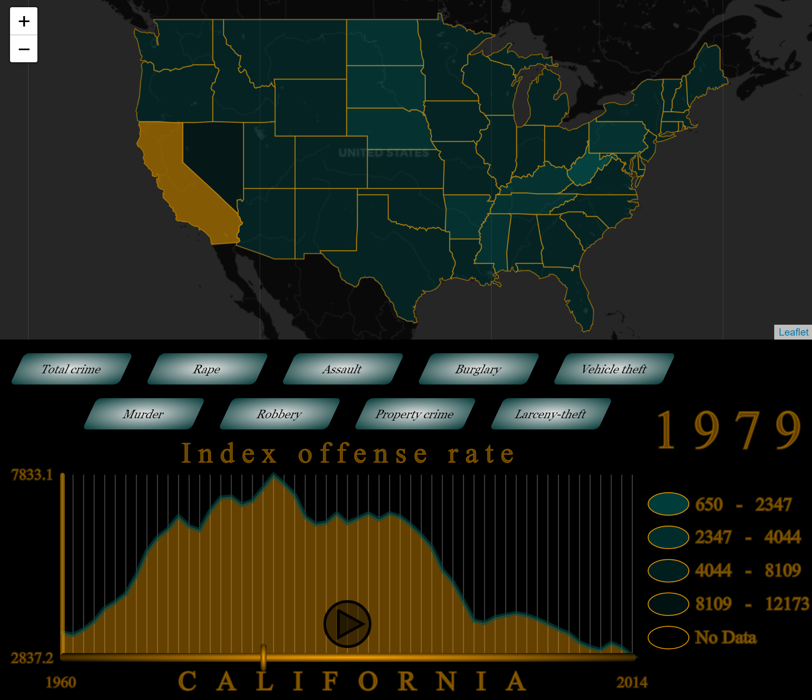

# United States crime map

An interactive web application to depict different crimes in the United States from 1960 to 2014. The buttons are for selecting the crime type, which is shown on the map and the graph. Using the slider it's possible to select a specific year to see the result on the map and by clicking on a state on the map, its data throughout the years is drawn on the graph. Also, when the selected year is not the last year in the dataset, it's possible to play a timelapse and see the chages in the selected crime type throughout the years.
The app uses [p5.js](https://p5js.org/) and [mappa](https://mappa.js.org/docs/tldr-p5.html) libraries to visualise data.

The game is deployed [here](https://khholst.github.io/US-crime-map/)
 

